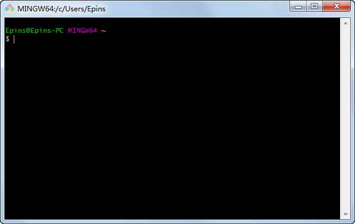

# Git教程


​	本教程是面向初学者的基础教程，即使你没有接触过版本控制器也可以轻松起步。这里将为你介绍 git 基础知识和常用命令，边学边练，轻松入门。

## git简介

​	git 是目前世界上最先进的分布式版本控制系统。为什么说它先进，是因为它和其他版本控制系统的主要差别在于Git只关心文件数据的整体是否发生变化，而大多数版本其他系统只关心文件内容的具体差异，这类系统（CVS，Subversion，Perforce，Bazaar 等等）每次记录有哪些文件作了更新，以及都更新了哪些行的什么内容。

​	Git另一个比较好的地方在于绝大多数操作都可以在本地执行，而每个本地都可以从服务器获取一份完整的仓库代码，而且在没网的时候仍然可以修改和使用大部分命令，在方便的时候再跟服务器进行同步，这样可以更好的实现多人联合编程。

集中式和分布式版本控制器有什么区别呢

​	先说集中式版本控制系统，版本库是集中存放在中央服务器的，而干活的时候，用的都是自己的电脑，所以要先从中央服务器取得最新的版本，然后开始干活，干完活了，再把自己的活推送给中央服务器。中央服务器就好比是一个图书馆，你要改一本书，必须先从图书馆借出来，然后回到家自己改，改完了，再放回图书馆。

​	集中式版本控制系统最大的毛病就是必须联网才能工作，如果在局域网内还好，带宽够大，速度够快，可如果在互联网上，遇到网速慢的话，可能提交一个10M的文件就需要5分钟，这还不得把人给憋死啊。

​	分布式版本控制系统根本没有“中央服务器”，每个人的电脑上都是一个完整的版本库，这样，你工作的时候，就不需要联网了，因为版本库就在你自己的电脑上。既然每个人电脑上都有一个完整的版本库，那多个人如何协作呢？比方说你在自己电脑上改了文件A，你的同事也在他的电脑上改了文件A，这时，你们俩之间只需把各自的修改推送给对方，就可以互相看到对方的修改了。

​	和集中式版本控制系统相比，分布式版本控制系统的安全性要高很多，因为每个人电脑里都有完整的版本库，某一个人的电脑坏掉了不要紧，随便从其他人那里复制一个就可以了。而集中式版本控制系统的中央服务器要是出了问题，所有人都没法干活了。

​	在实际使用分布式版本控制系统的时候，其实很少在两人之间的电脑上推送版本库的修改，因为可能你们俩不在一个局域网内，两台电脑互相访问不了，也可能今天你的同事病了，他的电脑压根没有开机。因此，分布式版本控制系统通常也有一台充当“中央服务器”的电脑，但这个服务器的作用仅仅是用来方便“交换”大家的修改，没有它大家也一样干活，只是交换修改不方便而已。

## git安装

- **在Linux上安装 Git**

  首先可以输入`git`检查系统有没有安装git

  ```bash
  $ git
  The program 'git' is currently not installed. You can install it by typing:
  sudo apt-get install git
  ```

  像上面的命令，有很多Linux会友好地告诉你Git没有安装，还会告诉你如何安装Git。

  如果你碰巧用Debian或Ubuntu Linux，通过一条`sudo apt-get install git`就可以直接完成Git的安装，非常简单。

  老一点的Debian或Ubuntu Linux，要把命令改为`sudo apt-get install git-core`，因为以前有个软件也叫GIT（GNU Interactive Tools），结果Git就只能叫git-core了。由于Git名气实在太大，后来就把GNU Interactive Tools改成gnuit，git-core正式改为git。

  如果是其他Linux版本，可以直接通过源码安装。先从Git官网下载源码，然后解压，依次输入：`./config，make，sudo make install`这几个命令安装就好了。

- **在Mac OS X上安装Git**

  1. 安装homebrew，然后通过homebrew安装Git，具体方法请参考homebrew的文档：http://brew.sh/。
  2. 直接从AppStore安装Xcode，Xcode集成了Git，不过默认没有安装，你需要运行Xcode，选择菜单“Xcode”->“Preferences”，在弹出窗口中找到“Downloads”，选择“Command Line Tools”，点“Install”就可以完成安装了。（Xcode是Apple官方IDE，功能非常强大，是开发Mac和iOS App的必选装备，而且是免费的！）

- **在Windows上安装Git**

  从[Git官网](https://git-scm.com/)直接下载安装程序，然后按默认选项安装即可。（网速慢的同学请移步国内镜像）

  安装完成后，在开始菜单里找到“Git”->“Git Bash”，蹦出一个类似命令行窗口的东西，就说明Git安装成功！

  

  安装完成后，还需要最后一步设置，在命令行输入：

  ```bash
  $ git config --global user.name "Your Name"
  $ git config --global user.email "email@example.com"
  ```

  注意：`git config`命令的`--global`参数，用了这个参数，表示你这台机器上所有的Git仓库都会使用这个配置，当然也可以对某个仓库指定不同的用户名和Email地址。

## 创建版本库

​	版本库又名仓库，英文名repository，你可以简单理解成一个目录，这个目录里面的所有文件都可以被Git管理起来，每个文件的修改、删除，Git都能跟踪，以便任何时刻都可以追踪历史，或者在将来某个时刻可以“还原”。

**第一步**，创建一个版本库非常简单，首先，选择一个合适的地方，创建一个空目录：

```bash
$ mkdir gitlearn
$ cd gitlearn
$ pwd		# pwd命令用于显示当前目录
/c/mygit/gitlearn	# 这是在我电脑上gitlearn仓库的位置
```

​	如果你使用Windows系统，为了避免遇到各种莫名其妙的问题，请确保目录名（包括父目录）不包含中文。

**第二步**，通过git init命令把这个目录变成Git可以管理的仓库：

```bash
$ git init
Initialized empty Git repository in C:/mygit/gitlearn/.git/
```

瞬间Git就把仓库建好了，而且告诉你是一个空的仓库（empty Git repository），细心的读者可以发现当前目录下多了一个.git的目录，这个目录是Git来跟踪管理版本库的，没事千万不要手动修改这个目录里面的文件，不然改乱了，就把Git仓库给破坏了。

如果你没有看到.git目录，那是因为这个目录默认是隐藏的，用`ls -ah`命令就可以看见。

也不一定必须在空目录下创建Git仓库，选择一个已经有东西的目录也是可以的。

***把文件添加到版本库***

首先这里再明确一下，所有的版本控制系统，其实只能跟踪文本文件的改动，比如TXT文件，网页，所有的程序代码等等，Git也不例外。版本控制系统可以告诉你每次的改动，比如在第5行加了一个单词“Linux”，在第8行删了一个单词“Windows”。而图片、视频这些二进制文件，虽然也能由版本控制系统管理，但没法跟踪文件的变化，只能把二进制文件每次改动串起来，也就是只知道图片从100KB改成了120KB，但到底改了啥，版本控制系统不知道，也没法知道。

不幸的是，Microsoft的Word格式是二进制格式，因此，版本控制系统是没法跟踪Word文件的改动的，前面我们举的例子只是为了演示，如果要真正使用版本控制系统，就要以纯文本方式编写文件。

因为文本是有编码的，比如中文有常用的GBK编码，日文有Shift_JIS编码，如果没有历史遗留问题，强烈建议使用标准的UTF-8编码，所有语言使用同一种编码，既没有冲突，又被所有平台所支持。

> 使用Windows的童鞋要特别注意：

千万不要使用Windows自带的记事本编辑任何文本文件。原因是Microsoft开发记事本的团队使用了一个非常弱智的行为来保存UTF-8编码的文件，他们自作聪明地在每个文件开头添加了0xefbbbf（十六进制）的字符，你会遇到很多不可思议的问题，比如，网页第一行可能会显示一个“?”，明明正确的程序一编译就报语法错误，等等，都是由记事本的弱智行为带来的。建议你下载Notepad++代替记事本，不但功能强大，而且免费！记得把Notepad++的默认编码设置为UTF-8 without BOM即可。

现在我们编写一个readme.txt文件，内容如下：

```bash
Git is a version control system.
Git is free software.
```

一定要放到gitlearn目录下（子目录也行），因为这是一个Git仓库，放到其他地方Git再厉害也找不到这个文件。

> 把一个文件放到Git仓库只需要两步

1. 用命令`git add`告诉Git，把文件添加到仓库：

```bash
$ git add readme.txt
```

执行上面的命令，没有任何显示，这就对了，Unix的哲学是“没有消息就是好消息”，说明添加成功。

2. 用命令`git commit`告诉Git，把文件提交到仓库：

```bash
$ git commit -m "wrote a readme file"
[master (root-commit) cb926e7] wrote a readme file
 1 file changed, 2 insertions(+)
 create mode 100644 readme.txt
```

简单解释一下`git commit`命令，-m后面输入的是本次提交的说明，可以输入任意内容，当然最好是有意义的，这样你就能从历史记录里方便地找到改动记录。

嫌麻烦不想输入-m "xxx"行不行？确实有办法可以这么干，但是强烈不建议你这么干，因为输入说明对自己对别人阅读都很重要。实在不想输入说明的童鞋请自行Google，我不告诉你这个参数。

`git commit`命令执行成功后会告诉你，1个文件被改动（我们新添加的readme.txt文件），插入了两行内容（readme.txt有两行内容）。

为什么Git添加文件需要add，commit一共两步呢？因为commit可以一次提交很多文件，所以你可以多次add不同的文件，比如：

```bash
$ git add file1.txt
$ git add file2.txt file3.txt
$ git commit -m "add 3 files."
```

## 查看工作区状态

修改readme.txt文件，改成如下内容：

```bash
Git is a distributed version control system.
Git is free software.
```

现在，运行git status命令看看结果：

```bash
$ git status
# On branch master
# Changes not staged for commit:
#   (use "git add <file>..." to update what will be committed)
#   (use "git checkout -- <file>..." to discard changes in working directory)
#
#    modified:   readme.txt
#
no changes added to commit (use "git add" and/or "git commit -a")
```

`git status`命令可以让我们时刻掌握仓库当前的状态，上面的命令告诉我们，readme.txt被修改过了，但还没有准备提交的修改。

虽然Git告诉我们readme.txt被修改了，但如果能看看具体修改了什么内容，自然是很好的。所以，我们需要用git diff这个命令看看：

```bash
$ git diff readme.txt 
diff --git a/readme.txt b/readme.txt
index 46d49bf..9247db6 100644
--- a/readme.txt
+++ b/readme.txt
@@ -1,2 +1,2 @@
-Git is a version control system.
+Git is a distributed version control system.
 Git is free software.
```

`git diff`顾名思义就是查看difference，显示的格式正是Unix通用的diff格式，可以从上面的命令输出看到，我们在第一行添加了一个“distributed”单词。

知道了对readme.txt作了什么修改后，再把它提交到仓库就放心多了，提交修改和提交新文件是一样的两步，第一步是git add：

```bash
$ git add readme.txt
```

在执行第二步git commit之前，我们再运行git status看看当前仓库的状态：

```bash
$ git status
# On branch master
# Changes to be committed:
#   (use "git reset HEAD <file>..." to unstage)
#
#       modified:   readme.txt
#
```

`git status`告诉我们，将要被提交的修改包括readme.txt，下一步，就可以放心地提交了：

```bash
$ git commit -m "add distributed"
[master ea34578] add distributed
 1 file changed, 1 insertion(+), 1 deletion(-)
```

提交后，我们再用git status命令看看仓库的当前状态：

```bash
$ git status
# On branch master
nothing to commit (working directory clean)
```

Git告诉我们当前没有需要提交的修改，而且，工作目录是干净（working directory clean）的。

## 版本回退

现在，你已经学会了修改文件，然后把修改提交到Git版本库，现在，再练习一次，修改readme.txt文件如下：

```bash
Git is a distributed version control system.
Git is free software distributed under the GPL.
```

git log命令显示从最近到最远的提交日志，我们可以看到3次提交，最近的一次是append GPL，上一次是add distributed，最早的一次是wrote a readme file。

如果嫌输出信息太多，看得眼花缭乱的，可以试试加上--pretty=oneline参数：

```bash
$ git log --pretty=oneline
7d4cbfa731c62963fc03062d248efd57ef5af3f4 (HEAD -> master, origin/master, origin/HEAD) append GPL
585c6d622f251cb2b4dfd7bffd28215aab8cee59 add distributed
b2bdd80516aada07dbd8c303a216a35506fb59c2 wrote a readme file
```

需要友情提示的是，你看到的一大串类似7d4cbfa7...f5af3f4的是commit id（版本号），和SVN不一样，Git的commit id不是1，2，3……递增的数字，而是一个SHA1计算出来的一个非常大的数字，用十六进制表示，而且你看到的commit id和我的肯定不一样，以你自己的为准。为什么commit id需要用这么一大串数字表示呢？因为Git是分布式的版本控制系统，后面我们还要研究多人在同一个版本库里工作，如果大家都用1，2，3……作为版本号，那肯定就冲突了。

每提交一个新版本，实际上Git就会把它们自动串成一条时间线。如果使用可视化工具查看Git历史，就可以更清楚地看到提交历史的时间线。

准备版本回退

好了，现在我们启动时光穿梭机，准备把readme.txt回退到上一个版本，也就是“add distributed”的那个版本，怎么做呢？

首先，Git必须知道当前版本是哪个版本，在Git中，用HEAD表示当前版本，也就是最新的提交7d4cbfa7...f5af3f4（注意我的提交ID和你的肯定不一样），上一个版本就是HEAD^，上上一个版本就是HEAD^，当然往上100个版本写100个^比较容易数不过来，所以写成HEAD~100。

现在，我们要把当前版本“append GPL”回退到上一个版本“add distributed”，就可以使用git reset命令：

```bash
$ git reset --hard HEAD^
HEAD is now at 585c6d6 add distributed
```

--hard参数有啥意义？这个后面再讲，现在你先放心使用。

看看readme.txt的内容是不是版本add distributed：

```bash
$ cat readme.txt
Git is a distributed version control system.
Git is free software.
```

果然。还可以继续回退到上一个版本wrote a readme file，不过且慢，然我们用git log再看看现在版本库的状态：

```bash
$ git log
commit 585c6d622f251cb2b4dfd7bffd28215aab8cee59 (HEAD -> master)
Author: mao <maojunhui5214@163.com>
Date:   Thu Mar 22 21:09:27 2018 +0800

    add distributed

commit b2bdd80516aada07dbd8c303a216a35506fb59c2
Author: mao <maojunhui5214@163.com>
Date:   Thu Mar 22 21:06:08 2018 +0800

    wrote a readme file
```
