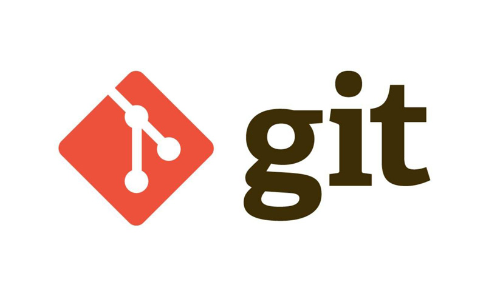
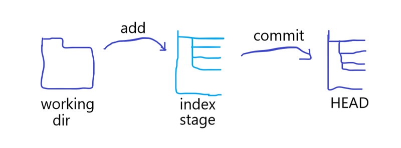

# Git基础教程



# 目录
[toc]

## Git配置

```bash
$ git config --global user.name "Your Name"
$ git config --global user.email "email@example.com"
```

`git config`命令的`--global`参数，表明这台机器上的所有Git仓库都会使用这个配置，也可以对某个仓库指定不同的用户名和邮箱地址

### 工作区、暂存区和版本库的区别

- 工作区：在电脑里能看到的目录；
- 版本库：在工作区有一个隐藏目录`.git`，是Git的版本库。  

Git的版本库中存了很多东西，其中最重要的就是称为stage（或者称为index）的**暂存区**，还有Git自动创建的`master`，以及指向`master`的指针`HEAD`。



进一步解释一些命令：

- `git add`实际上是把文件添加到暂存区
- `git commit`实际上是把暂存区的所有内容提交到当前分支

### 丢弃工作区的修改

```bash
$ git checkout -- <file>
```

该命令是指将文件在工作区的修改全部撤销，这里有两种情况：

1. 一种是file自修改后还没有被放到暂存区，现在，撤销修改就回到和版本库一模一样的状态；
2. 一种是file已经添加到暂存区后，又作了修改，现在，撤销修改就回到添加到暂存区后的状态。

总之，就是让这个文件回到最近一次git commit或git add时的状态。

### 克隆仓库

```bash
$ git clone git@github.com:mounui/GitLearn.git
```

### 删除文件

```bash
$ git rm <file>
```

`git rm <file>`相当于执行

```bash
$ rm <file>
$ git add <file>
$ git commit -m "say something..."
$ git push(optional)
```

#### 删除文件解释

Q：比如执行了`rm text.txt` 误删了怎么恢复？
A：执行`git checkout -- text.txt` 把版本库的东西重新写回工作区就行了
Q：如果执行了`git rm text.txt`我们会发现工作区的text.txt也删除了，怎么恢复？
A：先撤销暂存区修改，重新放回工作区，然后再从版本库写回到工作区

```bash
$ git reset head text.txt
$ git checkout -- text.txt
```

Q：如果真的想从版本库里面删除文件怎么做？
A：执行`git commit -m "delete text.txt"`，提交后最新的版本库将不包含这个文件

### 初始化一个Git仓库

```bash
$ git init
```

### 添加文件到Git仓库

```bash
$ git add <file>
$ git commit -m "description"	# 提交暂存区的文件并添加描述
$ git commit -am "description"	# 添加并提交文件
```

`git add`可以反复多次使用，添加多个文件，`git commit`可以一次提交很多文件，`-m`后面输入的是本次提交说明。

### 添加全部修改到暂存区

```bash
git add -A .
```

- `git add -A`表示添加所有内容
- `git add .` 表示添加新文件和编辑过的文件不包括删除的文件
- `git add -u` 表示添加编辑或者删除的文件，不包括新添加的文件。

### 查看工作区状态

```bash
$ git status
```

### 查看修改内容

- `git diff` 查看工作区(work dict)和暂存区(stage)的区别
- `git diff --cached` 查看暂存区(stage)和分支(master)的区别
- `git diff HEAD -- <file>` 查看工作区和版本库里面最新版本的区别

### 版本回退

```bash
$ git reset --hard HEAD^
```

以上命令是返回上一个版本，在Git中，用`HEAD`表示当前版本，上一个版本就是`HEAD^`，上上一个版本是`HEAD^^`，往上100个版本写成`HEAD~100`。

### 回退指定版本号

```bash
$ git reset --hard commit_id
```

commit_id是版本号，是一个用SHA1计算出的序列

### 放弃暂存区修改

1. 退回工作区

```bash
$ git reset HEAD <file>
```

2. 撤销工作区的修改

```bash
$ git checkout -- <file>
```

Tip：

1. 当你改乱了工作区某个文件的内容，想直接丢弃工作区的修改时，用命令`git checkout -- <file>`。
2. 当你不但改乱了工作区某个文件的内容，还添加到了暂存区时，想丢弃修改，分两步，第一步用命令`git reset HEAD <file>`，就回到了第一步，第二步按第一步操作。
3. 已经提交了不合适的修改到版本库时，想要撤销本次提交，进行版本回退，前提是没有推送到远程库。


## 分支

### 常用分支命令

```bash
$ git branch			# 查看分支
$ git branch <name>		# 创建分支
$ git checkout <name>	# 切换分支
$ git checkout -b <name># 创建+切换分支
$ git merge <name>		# 合并某分支到当前分支
$ git branch -d <name>	# 删除分支
$ git branch -D <name>	# 强制删除分支
```

### 分支策略

在实际开发中，我们应该按照几个基本原则进行分支管理：

1. master分支应该是非常稳定的，也就是仅用来发布新版本，平时不能在上面干活
2. 在dev分支上进行开发，也就是说，dev分支是不稳定的，到版本发布时，再把dev分支合并到master上，在master分支发布版本
3. 你和你的小伙伴们每个人都在dev分支上干活，每个人都有自己的分支，时不时地往dev分支上合并就可以了。
4. 如果有中间版本，比如测试版，预发布版，按照优先级和流程，从dev递归合并到master上。
5. 合并分支时，加上`--no-ff`参数就可以用普通模式合并，合并后的历史有分支，能看出来曾经做过合并，而fast forward合并就看不出来曾经做过合并。

### 查看分支合并图

```bash
$ git log --graph
```

### 查看分支树（简版）

```bash
$ git log --graph --pretty=oneline --abbrev-commit
```

### 禁用Fast-forward模式合并分支

因为本次合并要创建一个新的commit，所以加上`-m`参数，把commit描述写进去。  

合并分支时，加上`--no-ff`参数就可以用普通模式合并，能看出来曾经做过合并，包含作者和时间戳等信息，而fast forward合并就看不出来曾经做过合并。

```bash
$ git merge --no-ff -m 'description' <branchname>
```

### 储藏工作现场

```bash
$ git stash
```

### 查看储藏的工作现场

```bash
$ git stash list
```

### 恢复工作现场

```bash
$ git stash apply		# 恢复后需要手动删除储藏
$ git stash apply <stash version>	# 恢复指定的工作现场
```

### 删除工作现场

```bash
$ git stash drop
$ git stash drop <stash version>	# 删除指定的工作现场
```

### 恢复并删除工作现场

```bash
$ git stash pop
```

### 查看远程库信息

```bash
$ git remote -v
```

### 在本地创建和远程分支对应的分支

```bash
$ git checkout -b <branchname> <remotename>/<branchname>
```

### 建立本地分支和远程分支的关联

```bash
$ git branch --set-upstream <branchname> <remotename>/<branchname>
```

### 从本地推送分支

```bash
$ git push <remotename> <branchname>
```

### 从远程抓取分支

```bash
$ git pull
```

## 日志

```bash
$ git log			# 查看日志
$ git log --pretty=oneline	# 在一行显示日志
$ git log -n		# 查看前n条日志
$ git log --stat -n # 变更日志
```

### 查看提交修改

查看某次commit做了哪些修改

```bash
$ git show <commit_id>			# commid_id为提交的校验值
```

### 查看提交历史说明

```bash
$ git reflog
```

## 远程仓库

### 创建SSH Key

```bash
$ ssh-keygen -t rsa -C "youremail@email.com"

Generating public/private rsa key pair.  # 生成密钥对 
Enter file in which to save the key (/root/.ssh/id_rsa):  # 保存路径 (默认用户家目录.ssh下)
Enter passphrase (empty for no passphrase):   # 密码，默认空
Enter same passphrase again:   # 重复密码
Your identification has been saved in /root/.ssh/id_rsa.
Your public key has been saved in /root/.ssh/id_rsa.pub.
The key fingerprint is:
92:41:73:6d:ba:03:bf:36:f8:ab:a2:90:0c:9c:a1:85 youremail@email.com
The key's randomart image is:
+--[ RSA 2048]----+
|      o ..       |
| .   . o  o      |
|E..   .  o       |
|o.o   .o.        |
|oo    ooS.       |
|o.     .+        |
|o.     . o       |
| .  . . +        |
|  .. ..+oo       |
+-----------------+

```

### 关联远程仓库

```bash
$ git remote add <remotename> git@github.com:mounui/GitLearn.git	# remotename 为远程仓库名
```

### 取消关联远程库

```bash
$ git remote remove <remotename>
```

### 查看远程库

```bash
$ git remote
```

### 查看远程库详细信息

如果没有相关权限，则看不到相关地址信息  

例如没有推送权限，则看不到push地址

```bash
$ git remote -v
```

### 推送到远程仓库

```bash
$ git push origin <branchname>
```

`-u` 表示第一次推送master分支的所有内容,不过建议先clone在push，尽量避免此方法

```bash
$ git push -u origin <branchname>
```

日常提交只需要使用`git push`即可

### 从远程克隆

```bash
$ git clone git@github.com:mounui/GitLearn.git
```

日常获取只需要使用`git pull`即可

## 标签

tag就是一个让人容易记住的有意义的名字，它跟某个commit绑在一起。

### 新建一个标签

```bash
$ git tag <tagname>				# 标签名
```

命令`git tag <tagname>`用于新建一个标签，默认为HEAD，也可以指定一个commit id。

### 指定标签信息

```bash
$ git tag -a <tagname> -m 'description' <branchname> or <commit_id>
```

### PGP签名标签

```bash
$ git tag -s <tagname> -m 'description' <branchname> or <commit_id>
```

### 查看所有标签

```bash
$ git tag
```

### 推送一个本地标签

```bash
$ git push <remotename> <tagname>
```

### 推送全部未推送过的本地标签

```bash
$ git push <remotename> --tags
```

### 删除一个本地标签

```bash
$ git tag -d <tagname>
```

### 删除一个远程标签

```bash
$ git push origin :refs/tags/<tagname>
```

### 配置别名

```bash
$ git config --global alias.<name> <git-name>	# name为别名 git-name为命令名
```

建议熟悉git命令后使用

```bash
# 设置别名
$ git config --global alias.unstage 'reset HEAD'
# 使用别名撤掉修改,实际执行git reset HEAD test.py
$ git unstage test.py
```

对长命令的别名尤其好用

```bash
$ git config --global alias.lg "log --color --graph --pretty=format:'%Cred%h%Creset -%C(yellow)%d%Creset %s %Cgreen(%cr) %C(bold blue)<%an>%Creset' --abbrev-commit"
```

### 显示颜色

如果没有默认显示变更文件的颜色，推荐此选项

```bash
$ git config --global color.ui true
```

### git config

1. 配置Git的时候，加上--global是针对当前用户起作用的，如果不加，那只针对当前的仓库起作用。
2. 仓库的Git配置文件都在仓库.git/config文件中
3. 全局的Git配置文件放在用户主目录下的.gitconfig中(隐藏文件)
4. 如果想修改配置或者别名，直接修改或删掉即可

