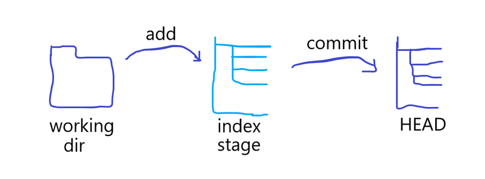

# GitLearn
## 安装

- git OSX：http://git-scm.com/download/mac
- git Windows：http://git-for-windows.github.io/
- git Linux：http://book.git-scm.com/2_installing_git.html

## 创建新仓库

创建新文件夹，打开，然后执行`git init`以创建新的 git 仓库

## 检出仓库

执行如下命令以创建一个本地仓库的克隆版本：

```shell
git clone /path/to/repository
```

如果是远端服务器上的仓库，你的命令会是这个样子：

```shell
git clone username@host:/path/to/repository
```

## 工作流

你的本地仓库由 git 维护的三棵“树”组成。第一个是你的**工作目录**，它持有实际文件；第二个是**暂存区（Index)**，它像个缓存区域，临时保存你的改动；最后是**HEAD**，它指向你最后一次提交的结果。



## 添加和提交

你可以提出更改（把它们添加到暂存区），使用如下命令：

```shell
git add <filename>
git add *
```

这是git基本工作流程的第一步；使用如下命令以实际提交改动：

```shell
git commit -m "代码提交的信息"
```

现在，你的改动已经提交到了HEAD，但是还没到你的远程仓库。

## 推送改动

执行如下命令可以将本地的改动推送到远程库：

```shell
git push or origin master	// origin:remote name	master:local branch
```

可以把master换成你想要推送的任何分支。

如果你还没有克隆现有仓库，并欲将你的仓库连接到某个远程服务器，可以用如下命令添加：

```shell
git remote add origin <server>
```

如此你就能够将你的改动推送到所添加的服务器上去了。

## 分支

分支是用来将特性开发绝缘开来的。在你创建仓库的时候，master是“默认的”的分支。在其他分支上进行开发，完成后再将它们合并到主分支上。


