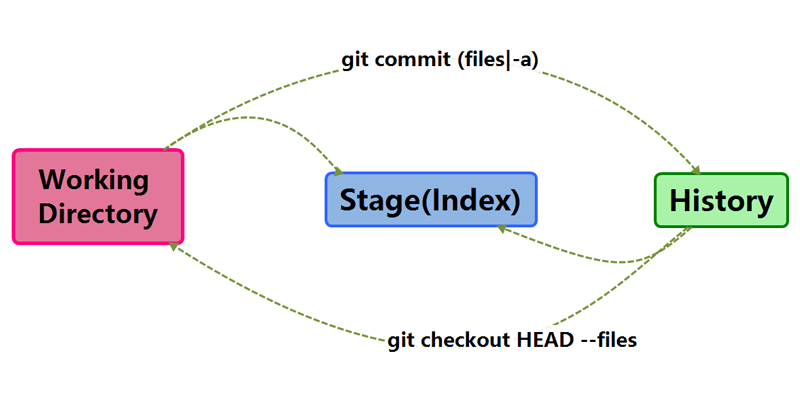
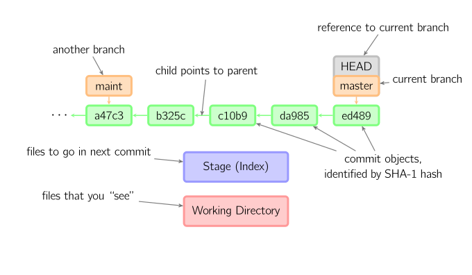

# 图解Git

此页图解git中的最常用命令。如果你稍微理解git的工作原理，这篇文章能够让你理解的更透彻。

## 基本用法

上面的条命令在工作目录、暂存目录(也叫做索引)和仓库之间复制文件。

- git add files 把当前文件放入暂存区域；
- git commit 给暂存区域生成快照并提交；
- git reset -- files 用来撤销最后一次git add files，你也可以用git reset 撤销所有暂存区域文件；
- git checkout -- files 把文件从暂存区域复制到工作目录，用来丢弃本地的修改；

你可以用 `git reset -p`, `git checkout -p`, or `git add -p`进入交互模式。

也可以跳过暂存区域直接从仓库取出文件或者直接提交代码。

- `git commit -a` 相当于运行 `git add` 把所有当前目录下的文件加入暂存区域再运行`git commit`；
- `git commit files` 进行一次包含最后一次提交加上工作目录中文件快照的提交。并且文件被添加到暂存区域；
- `git checkout HEAD -- files` 回滚到复制最后一次提交

## 约定

后文中以下面的形式使用图片。

绿色的5位字符表示提交的ID，分别指向父节点。分支用橘色显示，分别指向特定的提交。当前分支由附在其上的*HEAD*标识。 这张图片里显示最后5次提交，*ed489*是最新提交。 *master*分支指向此次提交，另一个*maint*分支指向祖父提交节点。

## 命令详解

#### Diff

有许多种方法查看两次提交之间的变动。下面是一些示例。

#### Commit

提交时，git用暂存区域的文件创建一个新的提交，并把此时的节点设为父节点。然后把当前分支指向新的提交节点。下图中，当前分支是*master*。 在运行命令之前，*master*指向*ed489*，提交后，*master*指向新的节点*f0cec*并以*ed489*作为父节点。

即便当前分支是某次提交的祖父节点，git会同样操作。下图中，在*master*分支的祖父节点*maint*分支进行一次提交，生成了*1800b*。 这样，*maint*分支就不再是*master*分支的祖父节点。此时，合并 (或者 衍合) 是必须的。

如果想更改一次提交，使用 `git commit --amend`。git会使用与当前提交相同的父节点进行一次新提交，旧的提交会被取消。

另一个例子是分离HEAD提交,后文讲。

