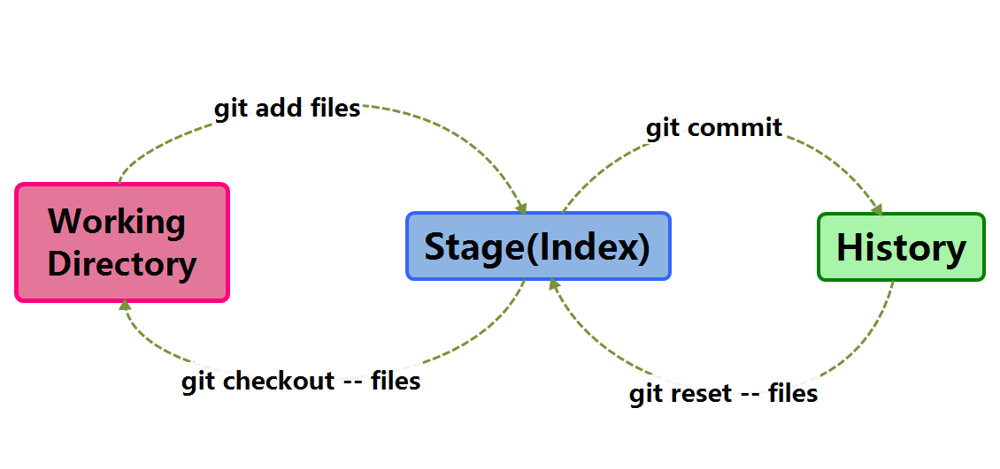

# 图解Git

此页图解git中的最常用命令。如果你稍微理解git的工作原理，这篇文章能够让你理解的更透彻。

## 基本用法

上面的条命令在工作目录、暂存目录(也叫做索引)和仓库之间复制文件。

- git add files 把当前文件放入暂存区域；
- git commit 给暂存区域生成快照并提交；
- git reset -- files 用来撤销最后一次git add files，你也可以用git reset 撤销所有暂存区域文件；
- git checkout -- files 把文件从暂存区域复制到工作目录，用来丢弃本地的修改；

